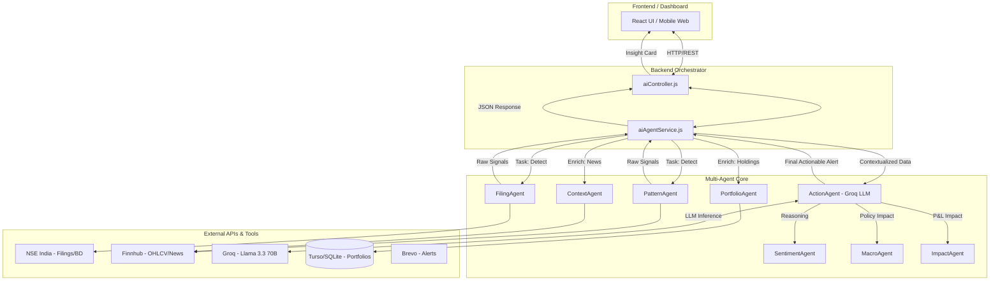

# ArthaNova: Agentic Intelligence Architecture

ArthaNova is built on a modular, multi-agent architecture designed to provide high-precision financial intelligence to Indian retail investors. The system employs a "Chain of Reasoning" approach where specialized agents collaborate to transform raw market data into actionable, risk-aware insights.

## 1. System Architecture Diagram

---

## 2. Agent Roles & Responsibilities

| Agent | Responsibility | Primary Tool(s) |
| :--- | :--- | :--- |
| **FilingAgent** | Monitors SEBI/NSE filings for bulk deals and insider trades. | NSE India, MarketDataService |
| **PatternAgent** | Scans real-time OHLCV data for breakouts, RSI shifts, and technical patterns. | Finnhub, technical-indicators |
| **ContextAgent** | Fetches and filters global and local market news relevant to active signals. | Finnhub News, AlphaVantage |
| **PortfolioAgent** | Retrieves user-specific exposure, AVG price, and sector concentration. | Turso (SQLite), Prisma |
| **ActionAgent** | The "Orchestrator Core" that synthesizes inputs into SEBI-aware advice. | Groq SDK (Llama 3.3) |
| **SentimentAgent** | Gauges market mood by analyzing news headlines and oscillator trends. | Groq Inference |
| **MacroAgent** | Injects RBI policy changes or tax updates into the reasoning context. | Market Data News |
| **ImpactAgent** | Quantifies financial materiality (estimated P&L impact) on user holdings. | Internal Logic |

---

## 3. Communication & Data Flow

ArthaNova uses a **3-Step Autonomous Pipeline** for its "Opportunity Radar" and "Trade Analysis" features:

1.  **Signal Detection (Ingestion)**: The `FilingAgent` and `PatternAgent` query live feeds. If a threshold (e.g., >3.2% stake sold or RSI > 70) is met, a signal is emitted.
2.  **Context Enrichment (Personalization)**: Signals are matched against the user's `PortfolioAgent` data. The `ContextAgent` adds news flow. This creates a "Rich Signal Object."
3.  **Actionable Generation (Reasoning)**: The Rich Signal is passed to the `ActionAgent`. It queries the Groq LLM with a highly specialized "SEBI-Aware" system prompt, instructing it to cite the filing reference and provide a risk-adjusted action (BUY/HOLD/REDUCE).

---

## 4. Tool Integrations

*   **Groq Llama 3.3 70B**: Chosen for ultra-low latency inference (<500ms), critical for real-time market alerts.
*   **Turso (libSQL)**: Distributed database for high-availability storage of portfolios and agent-generated logs.
*   **NSE India API**: Direct polling of corporate filings to bypass third-party delays.
*   **Finnhub**: Real-time ticker prices and global financial news.
*   **Brevo**: Triggers asynchronous push notifications when critical "Material" events are detected by the ImpactAgent.

---

## 5. Error-Handling & Resilience Logic

*   **Multi-Source Redundancy**: If NSE data is unavailable, the `PatternAgent` automatically shifts from filing-based signals to technical-based signals to ensure the "Radar" never goes dark.
*   **Chain Termination**: If the Groq LLM fails to return a valid structured response, the `ActionAgent` falls back to a template-based "Summary View" of the raw data, preventing a total UI crash.
*   **Input Protection**: A middleware layer sanitizes user queries before they reach the `ActionAgent` to prevent prompt injection or extraction of proprietary agent prompts.
*   **Latency Guard**: All agent tasks are wrapped in a 5000ms timeout. If an agent (e.g., News) hangs, the pipeline proceeds with available data to maintain "Agentic Responsiveness."
