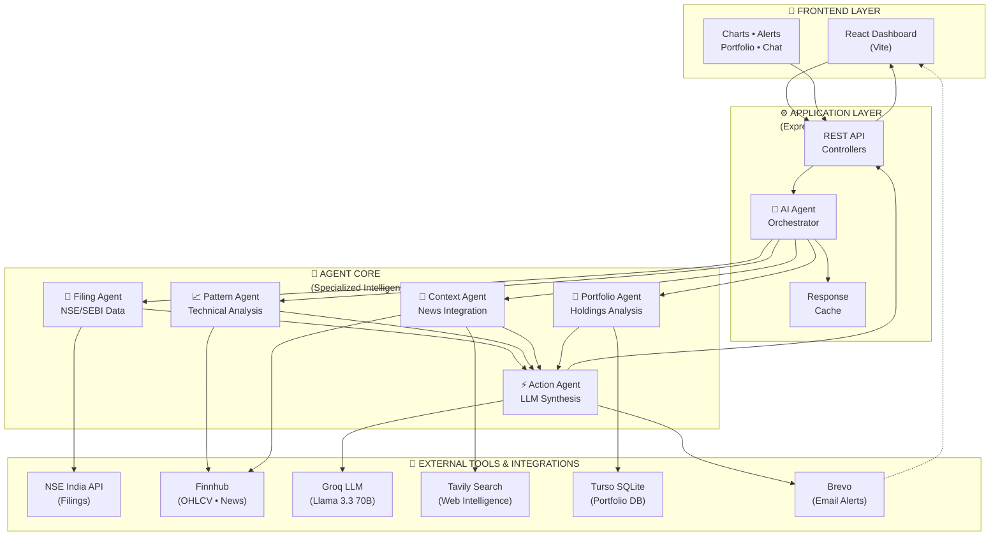
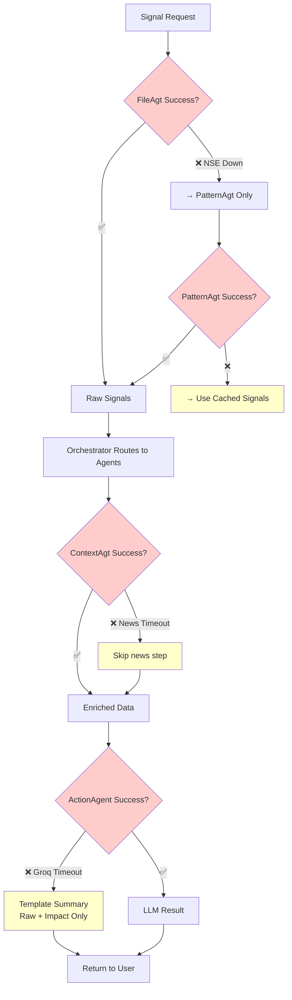

# ArthaNova — System Architecture

> **AI-Powered Financial Intelligence Engine for Indian Retail Investors**  
> Multi-agent orchestration platform delivering real-time, portfolio-aware market signals

---

## 1. System Architecture Overview



---

## 2. Agent Roles & Responsibilities

| Agent | Role | Input | Output |
|-------|------|-------|--------|
| **Filing Agent** | Monitors NSE/SEBI filings for bulk deals & insider trades | NSE API | Triggered signals w/ metadata |
| **Pattern Agent** | Technical analysis: RSI, breakout detection, trend validation | Finnhub OHLCV | Confidence-weighted patterns |
| **Context Agent** | Enriches signals with global/local news & sentiment | Finnhub + Tavily APIs | Contextual news summaries |
| **Portfolio Agent** | Matches signals to user holdings & calculates impact | Turso DB | P&L impact, relevance score |
| **Action Agent** | Synthesizes all inputs into actionable recommendations | All agents + Groq LLM | BUY/HOLD/REDUCE with rationale |

---

## 3. Data Flow & Communication Pattern

### **3-Step Signal Pipeline**

**Phase 1: Signal Detection (0-2s)**
- `FilingAgent` & `PatternAgent` poll external APIs in parallel
- Thresholds trigger (e.g., >3.2% stake sold, RSI > 70, unusual volume)
- Returns: Raw signal objects with timestamp & source

**Phase 2: Context Enrichment (2-4s)**
- `PortfolioAgent` matches signal to user holdings
- `ContextAgent` fetches relevant news & sentiment
- Cross-references regulatory context via Tavily
- Returns: Rich signal with P&L impact & relevance

**Phase 3: Actionable Synthesis (4-6s)**
- `ActionAgent` receives enriched signal bundle
- Queries Groq LLM with SEBI-aware system prompt
- LLM produces ranked actions w/ risk-adjusted confidence
- Returns: Final actionable alert to frontend & notification services

### **Async Complementary Flows**
- **Voice Interface**: Whisper transcription → NLP parsing → Agent query
- **Analytics Dashboard**: Signal history aggregation & KPI calculation  
- **Push Notifications**: OneSignal broadcast for material events

---

## 4. Tool Integrations

| Tool | Purpose | Response Time | Fallback |
|------|---------|---|---|
| **Groq Llama 3.3 70B** | Ultra-low latency LLM inference | <500ms | Template-based summary |
| **Finnhub** | Real-time OHLCV + financial news | 200-400ms | Cached prices (15min) |
| **NSE India API** | Direct corporate filing access | 400-800ms | Switch to pattern-only signals |
| **Turso (libSQL)** | Portfolio & signal history storage | 50-200ms | In-memory session cache |
| **Tavily** | Deep web search for regulatory/sentiment data | 1-2s | Finnhub news (fallback) |
| **Brevo** | Transactional email & alert delivery | Async | OneSignal push (async) |

---

## 5. Error Handling & Resilience



### **Resilience Mechanisms**

1. **Multi-Source Redundancy**: If NSE fails → PatternAgent takes over; if news fails → proceed with core signal
2. **Latency Guards**: All agents wrapped in 5s timeout; timeout → graceful degradation
3. **Input Sanitization**: Middleware prevents prompt injection before LLM queries
4. **Distributed Caching**: Turso + in-memory cache for high-availability signal history
5. **Circuit Breaker**: If external API fails 5x consecutively → automatic datasource switch
6. **Async Failures**: Email/notification failures logged to Sentry but don't block frontend response

---

## 6. Deployment & Infrastructure

- **Frontend**: Vite + React → Vercel CDN (global edge distribution)
- **Backend**: Express.js + Node.js → Railway/Docker (containerized, auto-scaling)
- **Database**: Turso (distributed SQLite replicas, edge caching)
- **LLM Inference**: Groq Cloud API (no self-hosting overhead)
- **Monitoring**: Sentry (error tracking, performance insights)
┌──────────────────────────────────────────────────────────────────────────────────────┐
│                                   SERVICE LAYER                                      │
├──────────────────────────────────────────────────────────────────────────────────────┤
│                                                                                      │
│   ┌───────────────────┐  ┌───────────────────┐  ┌───────────────────┐               │
│   │  Market Data      │  │  Groq LLM         │  │  Portfolio        │               │
│   │  Service          │  │  Service          │  │  Service          │               │
│   ├───────────────────┤  ├───────────────────┤  ├───────────────────┤               │
│   │ • getStockQuote   │  │ • chat()          │  │ • getHoldings     │               │
│   │ • getBulkDeals    │  │ • 40+ model       │  │ • calculatePnL    │               │
│   │ • getInsiderTrade │  │   fallback        │  │ • sectorMapping   │               │
│   │ • getCandlestick  │  │ • temp: 0.3       │  │                   │               │
│   │ • detectPatterns  │  │                   │  │                   │               │
│   └───────────────────┘  └───────────────────┘  └───────────────────┘               │
│                                                                                      │
└──────────────────────────────────────────────────────────────────────────────────────┘
                                         │
                    ┌────────────────────┼────────────────────┐
                    ▼                    ▼                    ▼
┌──────────────────────────────────────────────────────────────────────────────────────┐
│                                  EXTERNAL SERVICES                                   │
├──────────────────────────────────────────────────────────────────────────────────────┤
│                                                                                      │
│   ┌─────────────┐  ┌─────────────┐  ┌─────────────┐  ┌─────────────┐               │
│   │   🇮🇳 NSE    │  │  📊 Finnhub │  │  📰 News    │  │  🤖 Groq    │               │
│   │   India     │  │             │  │  Data.io    │  │   LLM       │               │
│   ├─────────────┤  ├─────────────┤  ├─────────────┤  ├─────────────┤               │
│   │ Bulk Deals  │  │ Real-time   │  │ Indian      │  │ llama-3.3   │               │
│   │ Insider     │  │ Quotes      │  │ Business    │  │ 70b         │               │
│   │ Trades      │  │ OHLCV       │  │ News        │  │             │               │
│   │ SAST/PIT    │  │ Profiles    │  │ Sentiment   │  │ Reasoning   │               │
│   └─────────────┘  └─────────────┘  └─────────────┘  └─────────────┘               │
│                                                                                      │
└──────────────────────────────────────────────────────────────────────────────────────┘
                                         │
                                         ▼
┌──────────────────────────────────────────────────────────────────────────────────────┐
│                                   DATA LAYER                                         │
├──────────────────────────────────────────────────────────────────────────────────────┤
│                                                                                      │
│   ┌─────────────────────────────────┐  ┌─────────────────────────────────┐          │
│   │       PostgreSQL (Prisma)       │  │        In-Memory Cache          │          │
│   ├─────────────────────────────────┤  ├─────────────────────────────────┤          │
│   │ • Users                         │  │ • API Response Cache            │          │
│   │ • Portfolios                    │  │ • Rate Limit Tracking           │          │
│   │ • Holdings                      │  │ • Session Data                  │          │
│   │ • Transactions                  │  │ • TTL: 5-15 minutes             │          │
│   └─────────────────────────────────┘  └─────────────────────────────────┘          │
│                                                                                      │
└──────────────────────────────────────────────────────────────────────────────────────┘
```

---

## 🤖 Agent Workflows

### Agent 1: Bulk Deal Analysis

> **Goal:** Detect distress selling vs. routine institutional blocks from NSE filings

```
┌─────────────────────────────────────────────────────────────────────────────────────┐
│                           BULK DEAL ANALYSIS AGENT                                  │
├─────────────────────────────────────────────────────────────────────────────────────┤
│                                                                                     │
│   INPUT: Symbol (e.g., "RELIANCE")                                                 │
│                                                                                     │
│   ┌─────────────────┐      ┌─────────────────┐      ┌─────────────────┐           │
│   │                 │      │                 │      │                 │           │
│   │  STEP 1         │ ───► │  STEP 2         │ ───► │  STEP 3         │           │
│   │  Filing Fetch   │      │  Context        │      │  AI Analysis    │           │
│   │                 │      │  Enrichment     │      │                 │           │
│   └─────────────────┘      └─────────────────┘      └─────────────────┘           │
│          │                        │                        │                       │
│          ▼                        ▼                        ▼                       │
│   ┌─────────────────┐      ┌─────────────────┐      ┌─────────────────┐           │
│   │ • NSE bulk-deals│      │ • Related news  │      │ • Groq LLM call │           │
│   │   API call      │      │ • Client history│      │ • Distress vs   │           │
│   │ • Parse fields  │      │ • Deal pattern  │      │   Routine verdict│          │
│   │ • Store citation│      │ • Stake % calc  │      │ • Recommendation│           │
│   └─────────────────┘      └─────────────────┘      └─────────────────┘           │
│                                                                                     │
│   OUTPUT:                                                                          │
│   {                                                                                │
│     type: "DISTRESS_SELLING" | "ROUTINE_BLOCK",                                   │
│     confidence: 85%,                                                               │
│     filing_citation: "NSE/BD/2026-03-26/RELIANCE",                                │
│     recommendation: { action: "AVOID", reason: "Promoter exit signal" }           │
│   }                                                                                │
│                                                                                     │
└─────────────────────────────────────────────────────────────────────────────────────┘
```

### Agent 2: Technical Breakout Detection

> **Goal:** Pattern recognition with conflicting signal resolution (RSI vs Momentum)

```
┌─────────────────────────────────────────────────────────────────────────────────────┐
│                        TECHNICAL BREAKOUT DETECTION AGENT                           │
├─────────────────────────────────────────────────────────────────────────────────────┤
│                                                                                     │
│   INPUT: Symbol (e.g., "INFY")                                                     │
│                                                                                     │
│   ┌─────────────────┐      ┌─────────────────┐      ┌─────────────────┐           │
│   │                 │      │                 │      │                 │           │
│   │  STEP 1         │ ───► │  STEP 2         │ ───► │  STEP 3         │           │
│   │  Data Fetch     │      │  Technical Calc │      │  Signal Resolve │           │
│   │                 │      │                 │      │                 │           │
│   └─────────────────┘      └─────────────────┘      └─────────────────┘           │
│          │                        │                        │                       │
│          ▼                        ▼                        ▼                       │
│   ┌─────────────────┐      ┌─────────────────┐      ┌─────────────────┐           │
│   │ • 90-day OHLCV  │      │ • RSI (14)      │      │ • Conflicting   │           │
│   │ • Live quote    │      │ • MA20/MA50     │      │   signal matrix │           │
│   │ • Volume data   │      │ • 52-week high  │      │ • LLM reasoning │           │
│   │                 │      │ • Volume surge  │      │ • Confidence %  │           │
│   └─────────────────┘      └─────────────────┘      └─────────────────┘           │
│                                                                                     │
│   CONFLICT RESOLUTION EXAMPLE:                                                     │
│   ┌─────────────────────────────────────────────────────────────────────────────┐ │
│   │  Signal          │ Status      │ Implication                                │ │
│   ├─────────────────────────────────────────────────────────────────────────────┤ │
│   │  52-Week High    │ BREAKOUT ✅ │ Bullish momentum confirmed                 │ │
│   │  RSI             │ 78 (HIGH) ⚠ │ Overbought — potential pullback            │ │
│   │  Volume          │ 2.3x AVG ✅ │ Strong conviction                          │ │
│   ├─────────────────────────────────────────────────────────────────────────────┤ │
│   │  AI VERDICT: "Valid breakout but reduce position size due to RSI > 70"     │ │
│   └─────────────────────────────────────────────────────────────────────────────┘ │
│                                                                                     │
└─────────────────────────────────────────────────────────────────────────────────────┘
```

### Agent 3: Portfolio-Aware News Prioritization

> **Goal:** Dynamic P&L impact assessment of macro events on user holdings

```
┌─────────────────────────────────────────────────────────────────────────────────────┐
│                      PORTFOLIO-AWARE NEWS PRIORITIZATION AGENT                      │
├─────────────────────────────────────────────────────────────────────────────────────┤
│                                                                                     │
│   INPUT: User ID (authenticated)                                                   │
│                                                                                     │
│   ┌─────────────────┐      ┌─────────────────┐      ┌─────────────────┐           │
│   │                 │      │                 │      │                 │           │
│   │  STEP 1         │ ───► │  STEP 2         │ ───► │  STEP 3         │           │
│   │  Portfolio Load │      │  News Ingest    │      │  Impact Rank    │           │
│   │                 │      │                 │      │                 │           │
│   └─────────────────┘      └─────────────────┘      └─────────────────┘           │
│          │                        │                        │                       │
│          ▼                        ▼                        ▼                       │
│   ┌─────────────────┐      ┌─────────────────┐      ┌─────────────────┐           │
│   │ • Query DB for  │      │ • Fetch macro   │      │ • Calculate     │           │
│   │   user holdings │      │   & sector news │      │   estimated P&L │           │
│   │ • Map to sectors│      │ • Match sectors │      │ • Rank by       │           │
│   │ • Calc exposure │      │   to holdings   │      │   materiality   │           │
│   └─────────────────┘      └─────────────────┘      └─────────────────┘           │
│                                                                                     │
│   OUTPUT EXAMPLE:                                                                  │
│   ┌─────────────────────────────────────────────────────────────────────────────┐ │
│   │ Rank │ Event                    │ Holdings Hit    │ Impact       │ Level   │ │
│   ├─────────────────────────────────────────────────────────────────────────────┤ │
│   │  1   │ RBI cuts Repo Rate 25bps │ HDFCBANK, SBIN  │ +₹2,340      │ 🔴 HIGH │ │
│   │  2   │ IT sector guidance weak  │ INFY, TCS       │ -₹1,850      │ 🟡 MED  │ │
│   │  3   │ Crude oil prices drop    │ ONGC            │ -₹420        │ 🟢 LOW  │ │
│   └─────────────────────────────────────────────────────────────────────────────┘ │
│                                                                                     │
└─────────────────────────────────────────────────────────────────────────────────────┘
```

---

## 🔄 Data Flow

```
┌─────────────────────────────────────────────────────────────────────────────────────┐
│                            REQUEST LIFECYCLE                                        │
├─────────────────────────────────────────────────────────────────────────────────────┤
│                                                                                     │
│   T+0 ──► User clicks "Analyze RELIANCE" on Opportunity Radar                      │
│           │                                                                         │
│   T+1 ──► POST /api/ai/bulk-deal?symbol=RELIANCE                                   │
│           │                                                                         │
│   T+2 ──► Auth middleware validates JWT                                            │
│           │                                                                         │
│   T+3 ──► AI Controller → Agent Orchestrator                                       │
│           │                                                                         │
│           ├──────────────────────────────────────────────────────────┐             │
│           │                    PARALLEL DATA FETCH                    │             │
│           │  ┌─────────────┐  ┌─────────────┐  ┌─────────────┐      │             │
│           │  │ NSE Bulk    │  │ Finnhub     │  │ NewsData.io │      │             │
│           │  │ Deals API   │  │ Quote API   │  │ News API    │      │             │
│           │  └──────┬──────┘  └──────┬──────┘  └──────┬──────┘      │             │
│           │         └────────────────┼────────────────┘              │             │
│           │                          ▼                               │             │
│           ├──────────────────────────────────────────────────────────┘             │
│           │                                                                         │
│   T+4 ──► Data aggregation & enrichment                                            │
│           │                                                                         │
│   T+5 ──► Groq LLM call with structured prompt                                     │
│           │                                                                         │
│   T+6 ──► Parse AI response, build alert JSON                                      │
│           │                                                                         │
│   T+7 ──► HTTP 200 → Frontend                                                      │
│           │                                                                         │
│   T+8 ──► Render alert card to user                                                │
│                                                                                     │
└─────────────────────────────────────────────────────────────────────────────────────┘
```

---

## ⚠️ Error Handling

```
┌─────────────────────────────────────────────────────────────────────────────────────┐
│                            ERROR HANDLING STRATEGY                                  │
├─────────────────────────────────────────────────────────────────────────────────────┤
│                                                                                     │
│   ┌────────────────────┐   ┌────────────────────┐   ┌────────────────────┐        │
│   │   EXTERNAL API     │   │   LLM SERVICE      │   │   DATABASE         │        │
│   │   FAILURE          │   │   FAILURE          │   │   FAILURE          │        │
│   ├────────────────────┤   ├────────────────────┤   ├────────────────────┤        │
│   │                    │   │                    │   │                    │        │
│   │  NSE API Timeout   │   │  Groq Rate Limit   │   │  Portfolio Empty   │        │
│   │        │           │   │        │           │   │        │           │        │
│   │        ▼           │   │        ▼           │   │        ▼           │        │
│   │  ┌────────────┐    │   │  ┌────────────┐    │   │  ┌────────────┐    │        │
│   │  │ Return []  │    │   │  │ Try next   │    │   │  │ Use demo   │    │        │
│   │  │ Log warn   │    │   │  │ model in   │    │   │  │ portfolio  │    │        │
│   │  │ Continue   │    │   │  │ 40+ chain  │    │   │  │ (8 stocks) │    │        │
│   │  └────────────┘    │   │  └────────────┘    │   │  └────────────┘    │        │
│   │                    │   │                    │   │                    │        │
│   └────────────────────┘   └────────────────────┘   └────────────────────┘        │
│                                                                                     │
│   ┌─────────────────────────────────────────────────────────────────────────────┐  │
│   │                         GROQ MODEL FALLBACK CHAIN                           │  │
│   ├─────────────────────────────────────────────────────────────────────────────┤  │
│   │                                                                             │  │
│   │   llama-3.3-70b  ──► llama-3.1-70b ──► llama-3.1-8b ──► mixtral-8x7b ──►   │  │
│   │                                                                             │  │
│   │   ──► gemma2-9b ──► ... (40+ models) ──► Raw data response (no AI)         │  │
│   │                                                                             │  │
│   └─────────────────────────────────────────────────────────────────────────────┘  │
│                                                                                     │
│   RESILIENCE PRINCIPLES:                                                           │
│   ┌─────────────────────────────────────────────────────────────────────────────┐  │
│   │  ✅ Never crash — always return partial/degraded results                    │  │
│   │  ✅ Log all failures for debugging (console.warn)                           │  │
│   │  ✅ Fallback data enables demo mode without API keys                        │  │
│   │  ✅ No retry loops — fail fast, move to fallback                            │  │
│   │  ✅ User-facing errors are generic                                          │  │
│   └─────────────────────────────────────────────────────────────────────────────┘  │
│                                                                                     │
└─────────────────────────────────────────────────────────────────────────────────────┘
```

---

## 🔗 Tool Integrations

| Service | Purpose | Rate Limit | Fallback |
|---------|---------|------------|----------|
| **NSE India** | Bulk deals, insider trades, SAST/PIT | ~100/min | Empty array |
| **Finnhub** | Real-time quotes, OHLCV, profiles | 60/min | Cached/null |
| **NewsData.io** | Indian business news | 200/day | Mock events |
| **Groq LLM** | AI reasoning & analysis | 30/min | 40+ model chain |
| **PostgreSQL** | User data, portfolios | N/A | Demo portfolio |

---

## 🔐 Security

```
┌─────────────────────────────────────────────────────────────────────────────────────┐
│                              SECURITY ARCHITECTURE                                  │
├─────────────────────────────────────────────────────────────────────────────────────┤
│                                                                                     │
│   ┌─────────────────┐  ┌─────────────────┐  ┌─────────────────┐                   │
│   │  🔑 API KEYS    │  │  🛡️ AUTH        │  │  ✅ VALIDATION  │                   │
│   ├─────────────────┤  ├─────────────────┤  ├─────────────────┤                   │
│   │ • Stored in     │  │ • JWT-based     │  │ • Symbol:       │                   │
│   │   .env only     │  │ • User ID from  │  │   alphanumeric  │                   │
│   │ • Never exposed │  │   token only    │  │   uppercase     │                   │
│   │   to frontend   │  │ • Per-user      │  │ • No PII sent   │                   │
│   │                 │  │   portfolio     │  │   to LLM        │                   │
│   └─────────────────┘  └─────────────────┘  └─────────────────┘                   │
│                                                                                     │
└─────────────────────────────────────────────────────────────────────────────────────┘
```

---

## 📁 Key Files

| File | Purpose |
|------|---------|
| `backend/src/services/aiAgentService.js` | Core orchestrator, 3-step pipeline |
| `backend/src/services/marketDataService.js` | External API integrations |
| `backend/src/services/groqService.js` | LLM wrapper with 40+ fallbacks |
| `backend/src/controllers/aiController.js` | REST endpoint handlers |
| `frontend/src/pages/OpportunityRadar.jsx` | Agent output display |

---

## ✨ Key Differentiators

| Feature | Description |
|---------|-------------|
| **3+ Autonomous Steps** | Each agent completes multi-step reasoning without human intervention |
| **Source Citation** | All recommendations cite NSE filing references |
| **Conflict Resolution** | Breakout agent resolves RSI vs momentum contradictions |
| **Portfolio-Aware** | News impact calculated on actual user holdings |
| **Graceful Degradation** | Works in demo mode without any API keys |

---

**ArthaNova** — Institutional-grade intelligence for retail Indian investors.
